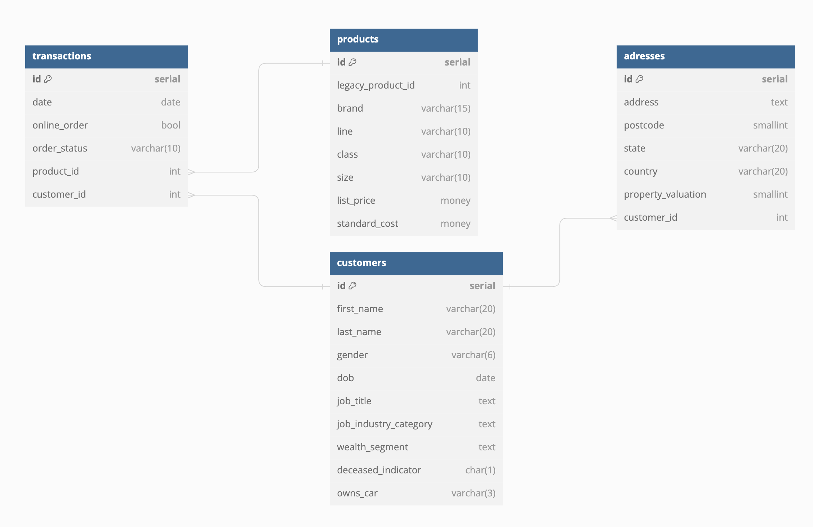

# Домашние задания по предмету "Системы хранения и обработки данных"

## Prerequisites

Для запуска PostgreSQL:

```
docker compose up
```

Для запуска jupyterlab:

```
poetry install
poetry run jupyter lab
```

## ДЗ 1

### Структура



### Нормализация

Исходная таблица "transaction":
- находится в 1НФ, 2НФ нарушена зависимостью продуктовых аттрибутов от product_id
- приводится к 3НФ за счет выделения аттрибутов продукта в отдельную таблицу.
Новая таблица "product" также требует введения аттрибута первичного ключа, чтобы соответствовать 3НФ.

Исходная таблица "сustomer":
- находится во 2НФ, т.к. каждое неключевое поле зависит от первичного ключа,
но при этом оценка собственности, вероятно, зависит от адреса, что приводит к транзитивной зависимости
- приводится к 3НФ за счет выделения аттрибутов адреса в отдельную таблицу, что также позволит одному пользователю иметь несколько адресов.
Новая таблица "address" намеренно оставлена в 2НФ для простоты.

### Создание таблиц и загрузка данных

[Ноутбук](notebooks/hw1.ipynb) для подготовки и загрузки данных

## ДЗ 2

Запросы можно найти в ноутбуке [hw2](notebooks/hw2.ipynb)

Предварительно необходимо создать БД 'hw2':

```sql
CREATE DATABASE hw2
```
